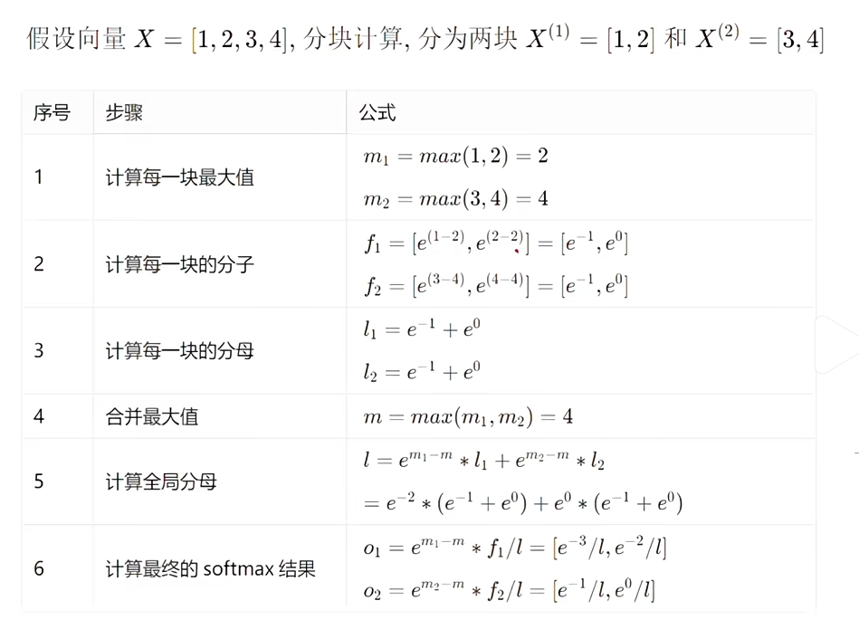

背景:
当输入序列（sequence length）较长时, Transformer的计算过程缓慢且耗费内存，即计算的矩阵会变得很大, 这是因为self-attention的<b>计算时间</b>和<b>内存存取复杂度</b>会随着<b>输入序列</b>的增加成二次增长。因此业界提出了几种加速方案.

## FlashAttention
Attention标准实现没有考虑到对内存频繁的IO操作, 它基本上将HBM加载/存储操作视为0成本。因此FlashAttention的优化方案是通过“split attention”的方式, 将多个操作融合在一起, 只从HBM加载一次，然后将结果写回来。减少了内存带宽的通信开销，并且采用了高效的GPU实现, 极大地提高了效率。 
核心：用分块softmax等价替代传统softmax。 
优点：节约HBM，高效利用SRAM，省显存，提速度。 

### 相关内容补充
内存不是一个单一的工件，它在本质上是分层的，一般的规则是:内存越快，越昂贵，容量越小。因此和木桶原理类似, 需要考虑到每个模块的瓶颈。 

- SRAM（Static Random Access Memory）是一种高速缓存内存，通常用于CPU和GPU的缓存层。它具有较低的访问延迟和较高的带宽，但成本较高，容量较小。SRAM的访问速度非常快，适合频繁访问的数据存储和计算操作。 

- HBM（High Bandwidth Memory）是一种高带宽的内存技术，通常用于GPU等高性能计算设备。它通过将多个DRAM芯片垂直堆叠，并使用高速接口与处理器直接连接，提供了极高的带宽和较大的容量。HBM适合存储大量数据，但访问速度相对较慢，适合大规模数据存储和传输。

这就导致了传统的Attention计算过程需要频繁地在SRAM和HBM之间进行数据传输, 这会带来显著的性能瓶颈。FlashAttention通过优化计算流程，减少了这种数据传输的次数，从而提高了整体的计算效率。因此FlashAttention的核心优化点在于减少内存访问次数，充分利用SRAM的高速性能，同时降低对HBM的依赖，从而实现更高效的Attention计算。

### 传统分块计算过程
例如原本的$QK^{T}$一次计算过程进行拆分, 分别将$Q$和$K^{T}$划分为为$m$,和$n$个小块, 然后依次将$m_{i}$和$n_{i}$小块计算的结果放置到指定的区域. 当然, 这样操作会带来额外的通讯次数的开销, 变成m * n, 但对于存储架构来说, SRAM与HBM的通信速率是非常快的, 在这里的通讯次数开销是可以接受的.

通信过程, 整个过程需要6次通信, 3次写入到SRAM, 3次到HBM中.
1. 将矩阵 Q 和K从 HBM 分块加载到 SRAM 中
2. 逐块计算 $S_{ij}  = Q_{i}K_{j}^{T}$, 并将每个子矩阵计算得出的 $S_{ij}$ 从SRAM 写入HBM。
3. 从 HBM 中加载所需的子矩阵  $S_{ij}$ 到 SRAM 中，为后续 softmax计算做准备。
4. 对每个子矩阵  $S_{ij}$ 计算 softmax，得到$P_{ij}= softmax( S_{ij})$，并将每个子矩阵 $P_{ij}$从 SRAM 写入 HBM。
5. 将矩阵 P和V从 HBM 分块加载到 SRAM 中。
6. 将P和V分成较小的块，逐块计算 $O_{ij} =P_{i}V_{j}$，并将每个子矩阵 $O_{ij}$ 从 SRAM 写入 HBM.

### FlashAttention的改进
FlashAttention改进了计算过程, 所有计算过程统一在SRAM中计算, 将最终的计算结果返回给HBM, 只进行一次读写. 其过程如下.

#### online-softmax 分块计算原理
原本softmax 需要先计算出所有的$S_{ij}$, 然后再进行softmax计算, 但是FlashAttention的online-softmax算法, 通过分块计算的方式, 在每个块计算完之后就进行softmax计算, 并且在计算过程中维护一个全局的最大值和指数和, 来保证数值稳定性. 具体来说, 在每个块计算完之后, 会更新全局的最大值和指数和, 以便在下一个块计算时使用. 这样做不仅可以节约内存带宽，还可以提高计算效率.
核心公式如下:

$𝑚_{𝑛𝑒𝑤}=max⁡(𝑚_{𝑜𝑙𝑑}−𝑚_{c})$

$𝑙_{𝑛𝑒𝑤}=𝑙_{𝑜𝑙𝑑} ·𝑒^{(𝑚_{𝑜𝑙𝑑}−𝑚_{𝑛𝑒𝑤} )}+𝑙_{c} ·𝑒^{(𝑚_{c}−𝑚_{𝑛𝑒𝑤} )}$

其中:
- 𝑚_{𝑐}: 当前块最大值
- 𝑚_{𝑜𝑙𝑑}: 当前全局最大值
- 𝑙_{𝑐}: 当前块局部指数和
- 𝑙_{𝑜𝑙𝑑}: 当前全局分母 指数和

详细计算原理示例及讲解: [小红书: 图解Flash Attention核心原理](http://xhslink.com/o/7622DEwSF21 )

## 共享KV 
多个Head共享使用1组KV，将原来每个Head一个KV，变成1组Head一个KV，来压缩KV的存储。代表方法：GQA，MQA等

1. <b>Multi-Head Attention</b>, 图1, 每一层的所有Head都独立拥有自己的KQV权重矩阵, 计算时各自使用自己的权重计算.
2. <b>Multi-Query Attention</b>, 图2, 每一层的所有Head，按照数量分组, 一组的成员, 共享同一个KQV权重矩阵来计算Attention。因此, 分最多组就是MHA(图左), 最少就是MQA(图右).
3. <b>Group-Query Attention</b>, 图3, 每一层的所有Head，都共享同一个KQV权重矩阵来计算Attention.
4. <b>Multi-Head Latent Attention</b>, 图4, 每个Transformer层，只缓存了权重$c_{t}^{KV}$和$k_{t}^{R}$, 个人认为可以理解为缓存了两个分解的低秩矩阵.

## 窗口KV
针对长序列控制一个计算KV的窗口，KV cache只保存窗口内的结果（窗口长度远小于序列长度），超出窗口的KV会被丢弃，通过这种方法能减少KV的存储，当然也会损失一定的长文推理效果。代表方法：Longformer等

## 量化压缩
基于量化的方法，通过更低的Bit位来保存KV，将单KV结果进一步压缩，代表方法：INT8等

## Page Attention
https://zhuanlan.zhihu.com/p/9632325957

## 参考地址
[[1] deepseek-v2](deepseek-v2:https://arxiv.org/pdf/2405.04434) 
[[2] deepseek-v3](deepseek-v3:https://arxiv.org/pdf/2412.19437) 
[[3] deepseek技术解读(1)-彻底理解MLA（Multi-Head Latent Attention）](https://blog.csdn.net/qq_27590277/article/details/145171014) 
[[4] 知乎: FlashAttention算法详解](https://zhuanlan.zhihu.com/p/651280772) 
